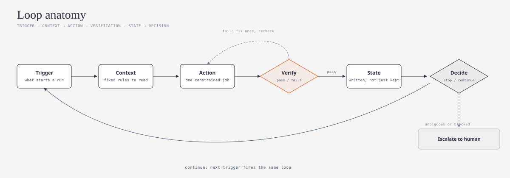
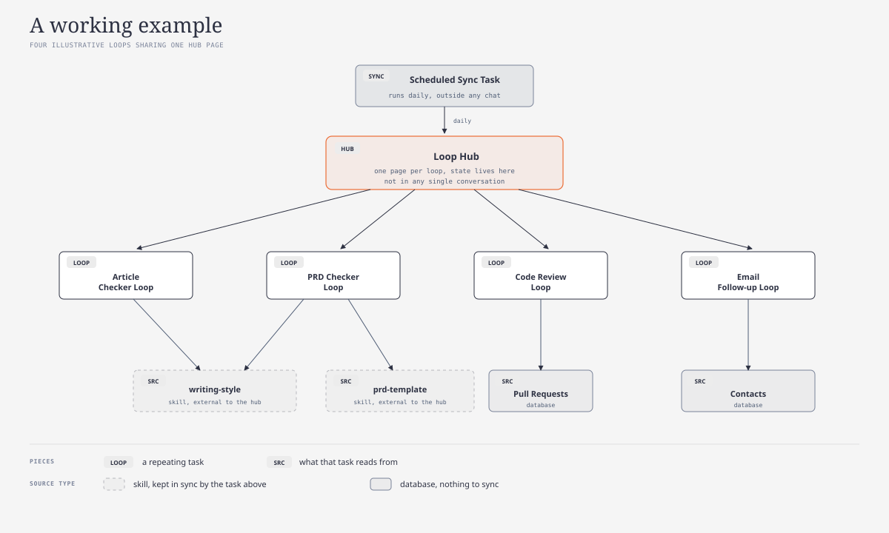

# loop-builder

**One line Summary: 
1 prompt, once. After that, Claude runs the whole thing on its own, checks its own work, and remembers where it left off, without you re-explaining anything next time.**

*Want the technical terms explained in plain speak? See the [Jargon Buster](JARGON.md).*

This is a Claude skill that helps you turn something you already ask Claude to do over and over into something that runs itself, checks its own work, and picks up where it left off next time, instead of you re-explaining it from scratch every time.

## What it does

Ask Claude to build one of these for you, or ask what's worth turning into one based on what you already do, and this skill walks Claude through:

1. Looking at what you already ask Claude to repeat
2. Checking whether it's actually a good fit for this, some tasks aren't
3. Building the basic pieces: what the goal is, the instructions, and a place to save progress
4. Starting small and safe: Claude reads and drafts first, nothing gets sent or changed without you saying so
5. Making sure the saved progress lives somewhere that survives, your notes app, a shared drive, wherever you already keep things
6. Testing it by hand a few times before trusting it to run on its own
7. Telling you plainly when it's actually ready

It also watches for the common ways these go wrong the first time: checking too quickly and missing things, saving progress but never actually looking at it again, and two copies of the same rule quietly disagreeing after one gets updated and the other doesn't.

## How it works

*Diagrams below follow the visual language of [cathrynlavery/diagram-design](https://github.com/cathrynlavery/diagram-design):*

One prompt sets this up. From there, Claude runs the whole cycle on its own, checking its own work and remembering where it left off, no re-explaining needed on the next run. The only other moment you're needed is when something's genuinely stuck, Claude stops and asks instead of guessing. Progress gets saved wherever you already keep things, Notion, Google Drive, Microsoft OneDrive, or plain files, not anything proprietary.

An example: 4 separate repeating tasks, all saving their notes in the same shared place. 2 of them (dashed boxes) depend on a set of rules that could change later, so they need an occasional check that they're still up to date. 2 of them (solid boxes) just look something up and don't have that problem.

## How to install

**Claude.ai / Claude apps**: upload `SKILL.md` as a custom skill, or place this folder where your Claude setup looks for skills.

**Claude Code**: drop this folder into your skills directory (commonly `~/.claude/skills/` or your project's `.claude/skills/`).

## How to use it

Once installed, talk to Claude normally:

- "Help me build a loop out of my [X] workflow"
- "What could I turn into a loop based on the skills I already have?"
- "Am I already running a loop?"

The skill triggers on its own; you don't need to invoke it by name.

---

*New terms? See the [Jargon Buster](JARGON.md) for plain-English explanations of trigger, verification, state, permission level, drift, and more.*
